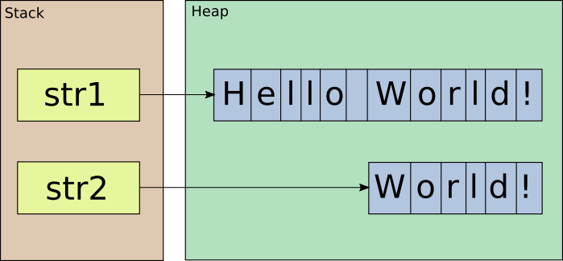
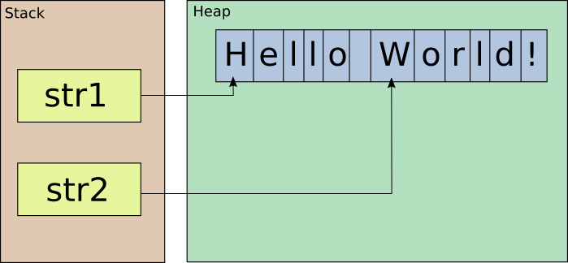

@title[Span&lt;T&gt; and Refs]

# Span&lt;T&gt; and Refs 

### *Safe memory optimizations in .NET*

**Antão Almada**<br>
*Principal Engineer @ Farfetch*<br>

@fa[creative-commons] @fa[creative-commons-by] 

---

## Safe memory optimizations in .NET

- Passing by reference
  + in
  + readonly struct
  + ref returns
  + ref locals
- Contiguous memory handling
  + Span&lt;T&gt;
  + Memory&lt;T&gt;

NOTE:

This presentation focus new features made available with C# 7 and .NET Core 2.1.

All these can significantly improve performance both CPU and memory.

"Safe" because some of these optimizations where possible but using pointers and the keyword 'unsafe'.

---

# Passing by reference

+++

## .NET Types 

- Value Types
- Reference Types
- Pointer Types

+++

## Value Types

- Byte, SByte, Int16, UInt16, Int32, UInt32, Int64, UInt64 
- Single, Double, Decimal
- Boolean, Char
- **'struct'**

+++

## Reference Types

- String
- **'class'**

+++

## Value Types

- Allocated on the stack 
  + Except when "boxed"
- Arguments passed by value
  + Full content is copied every time

Note:

- Allocated on the stack **is an advantage**.
- Arguments passed by value **may be a disadvange**.

+++

## Value over Reference Types

- Smaller memory footprint.
- Less GC overhead.
- Better performance on interface method calls.

+++

## DMS angle value type

```csharp
public struct Angle
{
    public int Degrees;
    public int Minutes;
    public double Seconds;
    
    public static void ByValue(Angle angle) {}
    public static void ByReference(ref Angle angle) {}
}
```

@[3-5]
@[7-8]

NOTE:

Size of structure is 128 bits => 16 bytes.

+++

## calls

```csharp
public class Example 
{
    Angle angle = new Angle { Degrees = 90, Minutes = 0, Seconds = 0.0 };
    
    void CallByValue() => 
        Angle.ByValue(angle);
    
    void CallByReference() => 
        Angle.ByReference(ref angle);
}
```

@[5-6, 8-9]

NOTE:
[SharpLab.io](https://sharplab.io/#v2:C4LglgNgPgsAUAAQMwAIDOwBOBXAxsFAQQDsBzCAU3gG94V6VkUxiCARC0zCitAbjoMmLAgFkW2YLwFwGjVABMA9tgBGlFAGUKuJcQX9B9I/MYBGAGyMALCgBCATwBqAQwjYKAChLkKKF2SUAJQo1AC+JkwIljb2DgBKFABmFNzEuF7cSUSBfgG+IeHwEXDwUQBMKACiAB4uALYADho0Jj4a+RoAvCjEFADuOb6hKBxcPGgoPQCcAAwANCjixJK8UygLWjp6BuuzAHSzKGEycpG2AMJuEI6u7l4hXQB8KCZy7RT7t24enp0UQVODHOKCuEBuCWSqQo6QeUxebwYHy+kJSaQyniy/lygOK8CAA===)

+++

## Intermediate Language

```
.method private hidebysig 
instance void CallByValue () cil managed 
{
    IL_0000: ldarg.0
    IL_0001: ldfld valuetype Angle Example::angle
    IL_0006: call void Angle::ByValue(valuetype Angle)
    IL_000b: ret
}

.method private hidebysig 
instance void CallByReference () cil managed 
{
    IL_0000: ldarg.0
    IL_0001: ldflda valuetype Angle Example::angle
    IL_0006: call void Angle::ByReference(valuetype Angle&)
    IL_000b: ret
}
```

@[1-2,10-11]
@[4-7, 13-16] (ldfld - Pushes the **value of field** onto the stack.<br/>ldflda - Pushes the **address of field** onto the stack.)

+++

## JIT Assembly

```
Example.CallByValue()
    L0000: push ebp
    L0001: mov ebp, esp
    L0003: add ecx, 0x4
    L0006: sub esp, 0x10
    L0009: movq xmm0, [ecx]
    L000d: movq [esp], xmm0
    L0012: movq xmm0, [ecx+0x8]
    L0017: movq [esp+0x8], xmm0
    L001d: call Angle.ByValue(Angle)
    L0022: pop ebp
    L0023: ret

Example.CallByReference()
    L0000: add ecx, 0x4
    L0003: call Angle.ByReference(Angle ByRef)
    L0008: ret
```

@[1-12]
@[14-17]

+++

## benchmarks

```
          Method |      Mean |     Error |    StdDev | Scaled | ScaledSD |
---------------- |----------:|----------:|----------:|-------:|---------:|
     CallByValue | 0.0489 ns | 0.0115 ns | 0.0102 ns |   1.00 |     0.00 |
 CallByReference | 0.0164 ns | 0.0062 ns | 0.0049 ns |   0.36 |     0.15 |
```

+++

```
public struct Angle
{
    public int Degrees;
    public int Minutes;
    public double Seconds;
    
    public static double ToDegrees(ref Angle angle) =>
        angle.Degrees + angle.Minutes / 60.0 + angle.Seconds / 3600.0;
}
```

@[7-8] (Pass argument by reference)
@[8] (No mutation are performed)

NOTE:

Using pass-by-reference improves performance but usually means the value will be changed, which it's not doing!

[SharpLab.io](https://sharplab.io/#v2:C4LgTgrgdgPgAgBgARwIwG4CwAoHcDMSAzsJAMbBICCUA5gDYCmOA3jkhyoQJZSUAijWmEaMiWbJy5JelALK8IwMRKkEkAEwD2EAEZMkAZUZktUDePacrHdWgBsmnfsZIAKlsHDRRABQiAM2o6AwBDEMYASiQAXgA+GykkcIZGADovETEkAGpkiLSFKCVsgHokewQ05DyUpjTjU3MiJHL8SqqECQBfHDxCOAAmJABRAA9QgFsABwNWRLtURzgAFhRUAA5faMS2bABIKQA3ULB81NikKEYAd2CLliRMn0uATgQAGiQikpaYpHwnyMJjMFkunSQ3VUSVsqFevhoqTSHmeYn8jCCdSikWhHF62HxQA=)

---

# in

+++

## Callee

```
public struct Angle
{
    public int Degrees;
    public int Minutes;
    public double Seconds;
    
    public static double ToDegrees(in Angle angle) =>
        angle.Degrees + angle.Minutes / 60.0 + angle.Seconds / 3600.0;
}
```

@[7-8] ('in' = 'ref readonly')

NOTE:

'in' is new keyword that means 'ref readonly' => no muttations allowed

**Better performance?**

+++

## Caller

```
var angle = new Angle { Degrees = 90, Minutes = 30, Seconds = 0.0 };
Console.WriteLine(Angle.ToDegrees(in angle));
```

@[2] (The use of 'in' is optional)

+++

## Caller generated code

```
Angle angle = default(Angle);
angle.Degrees = 90;
angle.Minutes = 30;
angle.Seconds = 0.0;
Angle angle2 = angle;
Console.WriteLine(Angle.ToDegrees(ref angle2));
```

@[5] (A defensive copy is performed)

NOTE:

**Defensive copies are performed every time an instance is declared as readonly but a method is called that may mutate it!**

[SharpLab.io](https://sharplab.io/#v2:D4AQDABCCMDcCwAoJIDMEDOAXATgVwGMsIBBAOwHMAbAUyQG8kJmp0BLM4gERopxpoYEiFqwgdiAWQ54sg4aLQQAJgHs8AI1oQAyjQKqyyoUxanmSmADYV6rTQgAVVTz4CMACg6lK2gIa+NACUEAC8AHzmohAB1DQAdK78ghAA1DGB8dJksikA9BBWYPGQ6bG08XoGRhgQBahFxWDCAL5IKOggAEwQAKIAHn4AtgAO2gxRltA2IAAsUNAAHB4hUYyIAJCiAG5+OBlxYRBkNADuPof0EEnuRwCcYAA0ENm5taEQqE+6+obGR00IC0FNELNA7h5yHF4s4boIPOVgkEQcw2og0UA===)

---

# readonly struct

+++

```
public readonly struct Angle
{
    public readonly int Degrees;
    public readonly int Minutes;
    public readonly double Seconds;
    
    public Angle(int degrees, int minutes, double seconds) =>
        (Degrees, Minutes, Seconds) = (
        	degrees, 
        	minutes < 60 ? 
        		minutes : 
        		throw new ArgumentOutOfRangeException(nameof(minutes)), 
        	seconds < 60.0 ? 
        		seconds : 
        		throw new ArgumentOutOfRangeException(nameof(seconds))
    	);
        
    public static double ToDegrees(in Angle angle) =>
        angle.Degrees + angle.Minutes / 60.0 + angle.Seconds / 3600.0;
}
```

@[1] ('readonly struct')
@[3-5] (Immutable => readonly fields)
@[7-16] (Constructor required to initialize)
@[18-19] (No changes!)

NOTE:

´readonly struct' guarantees that the struct is immutable. The value can only be set by the constructor.

[SharpLab.io](https://sharplab.io/#v2:D4AQDABCCMDcCwAoJIDMEBOBTAhgEwHsA7AGwE8IBnAFwwFcBjaiAQSIHMSskBvJCAVHTZ8xchACWRZgBEs7bFkoJEgoZlyFSFKcwCyUutSUq1aDaO0RCdAEZcIAZSwNieZf0GeB5tpywAFLrW8oqUADSS0hAAtobGEdYEdg6ULm6UAJQQALwAfN5qEAFyClhKkQZERhVO6UTu2TnFhWoAkHih5Ymtgm1x1QkQADwQAGyQAPyx8UoQAFwQ1AAWGAQA7hBEWJssGOx0MVjSAPJGJwBmAEo4HFgAogAeDFgADtQSxAFEOEcEFwEBjUsplIr0BG00q4GpQRuMwAA6KZUeruBZLVYbLY7Vj7Q7HahnQnXW7sB7PN4fL4/P4AqEZTKZQptTKmIoCQrmGBjJIpLAQAAqBFKYSCRFYHAcpK4TQKqnZEGlWARIu6EAA1IrJcqqsCIAB6eFIjVa/wI5zQtGG1ATRFgFQAXyQKHQIAATBAnr9Xg5eJzXdAeSAACxQaAADgC2UKfEQbTUADccBhTQ5mttdtqAp0ykpFgBOMCRIEJRaoIsoy2URZ21ngsP5gJ+LgIoWqpQBJWMtkCJ2IPtAA)

+++

## Caller generated code

```
Angle angle = new Angle(90, 30, 0.0);
Console.WriteLine(Angle.ToDegrees(ref angle));
```

@[1-2] (No defensive copies)

---

# ref returns

+++

## ref returns
@ul[spaced-list-items]

- Available on the CLR since first version!
- **Now available to you on C#!**

@ulend

+++

```
struct Mutable
{
    int value;

    public Mutable(int value) => 
        this.value = value;

    public int Value =>
        value;

    public void Increment() => 
        value++; 
}

var list = new List<Mutable> { new Mutable(1) };
list[0].Increment();
Console.WriteLine(list[0].Value); // value did not change!

var item = list[0];
item.Increment();
list[0] = item;
Console.WriteLine(list[0].Value); // value changed!       

var array = new Mutable[] { new Mutable(1) };
array[0].Increment();   
Console.WriteLine(array[0].Value); // value changed!
```

@[1-13] (*Mutable* contains a private integer field)
@[11-12] (*Increment()* mutates the value)
@[15-17] (The value in the list is **not mutate** as index operator returns a copy)
@[19-22] (Mutation has to be applied on the copy and then copied back to the list)
@[24-26] (The value in the array is **mutated** as index operator returns a reference)

NOTE:
[SharpLab.io](https://sharplab.io/#v2:C4LgTgrgdgPgAgBgARwIwG4CwAoRLUAsW2OAzsJAMbBICyEwAhgEYA2ApjgN45J9IBLKDQBujVhHbFe/OAGY6DFhwAUQ0eMkBKJAF4AfEhn9+wABYDSAOjET2epLcnTsJ+YOFIAapvsHjJo6+Lm4KcARIAJJQlGDsALbswio6BkaugXxO7ADUOejpAL44OO5oAGwoAEz4AOzpPBl8ZaiV4fgAHCnpJo2ZWYxgSKyWNLpIUOwA7kgAMqMAPPRMbOyGXBPTiiuqqDqFxP3DowDaCAC6VtGxCUnAKYf9aACcKiPkZ5c+dloFAPR/IJ2JAAEwEIImAHsaJQzIwoABzdgAQhKTUCYiGAmACQc72An0emWxCSuMTiiWSvwCJnxnwcJPiRMCLzepwuVm+2n+gOySFh8KRIOR/TRR0xSEGYEYAE8HJMZstlOwTuckBsFdtlSo9kgDjT+FLZZ8yTdKfdfvwDc1UK8jTKTVz2JaAUDJPy4Yj2MLRejithCkA==)

+++

## ref returns

### Can only be used on variables that survive scope exit!

+++

## ref returns

- **Can't** be used on:
  + Local variables
  + 'this'
- **Can** be used on:
  + Heap-allocated variables
  + Passed-by-reference arguments

+++

## Max

```
public static ref readonly Angle Max(in Angle left, in Angle right) =>
    ref Angle.ToDegrees(left) > Angle.ToDegrees(right) ? 
        ref left : 
        ref right;

public static ref readonly Angle Max(in Angle left, in Angle right)
{
    if (Angle.ToDegrees(left) > Angle.ToDegrees(right))
        return ref left;

    return ref right;
}
```

@[1-4] (lambda-style syntax)
@[6-12] (classic syntax)

NOTE: 

[SharpLab.io](https://sharplab.io/#v2:D4AQDABCCMDcCwAoJIDMEBOBTAhgEwHsA7AGwE8IBnAFwwFcBjaiAQSIHMSskBvJCAVHTZ8xchACWRZgBEs7bFkoJEgoZlyFSFKcwCyUutSUq1aDaO0RCdAEZcIAZSwNieZf0GeB5tpywAFLrW8oqUADSS0hAAtobGEdYEdg6ULm6UAJQQALwAfN5qEAFyClhKkQZERhVO6UTu2TnFhWoAkHih5Ymtgm1x1QkQADwQAGyQAPyx8UoQAFwQ1AAWGAQA7hBEWJssGOx0MVjSAPJGJwBmAEo4HFgAogAeDFgADtQSxAFEOEcEFwEBjUsplIr0BG00q4GpQRuMwAA6KZUeruBZLVYbLY7Vj7Q7HahnQnXW7sB7PN4fL4/P4AqEZTKZQptTKmIoCQrmGBjJIpLAQAAqBFKYSCRFYHAcpK4TQKqnZEGlWARIu6EAA1IrJcqqsCIAB6eFIjVa/wI5zQtGG1ATRFgNkc+U+dDcjQXCxacR+Bx6HCPMUS/wQLgXaiRKSBhwYCTsZbUWXgorYd3e5VC1VKAIh+MQPKRtPCrqZ6OxnPTZPBrCh9EVktxlSc9AEABuWAw0c6UGgkCFjloUnYAQTTqKABIAEQ8DOUAC+AAaIDxdQkZwByRcWjIzgA64/HKhnSBQLoATBAnr9Xg5eI2uzyQAAWLsADiHEEKfEQbTUzZwGFNXDQLk2K7NqASdGUSiLAAnGAkRAgkiyoHBKKWpQix2qySDfoIv7/kqZ7NNsoH+OBRboRAsHwbMFHIZE9Iwos0BIlhI5mNA0EBKmCK+v6SrQJEBGMg6ECHogYlAA=)

---

# ref locals

NOTE:

Allow storing references as local variables

+++

## MaxBy

```
public static ref Angle MaxBy(this Angle[] angles)
{
	if (angles.Length == 0)
		throw new ArgumentException(nameof(angles));

	ref var max = ref angles[0];
	for (var index = 1; index < angles.Length; index++)
	{
		ref var current = ref angles[index];
		if (Angle.ToDegrees(current) > Angle.ToDegrees(max))
				max = ref current;
	}

	return ref max;
}
```

@[1] (Returns a reference to the array item with the maximum value)
@[6] (Keeps a reference to the first item of the array)
@[7-12] (Iterates on the rest of the array)
@[9] (Keeps a reference to the current item of the array)
@[10-11] (Keep a reference to the largest value of the two references)
@[14] (Return a reference to the item with the largest value)

NOTE:

[SharpLab.io](https://sharplab.io/#v2:EYLgHgbALAPgAgBgARwIwG4CwAoHcDMSATgKYCGAJgPYB2ANgJ5IDOALkQK4DGrSAgjQDmdEjgDeOJFJSFSlWoyQBLGrwAiJQaRLMs2aTOLlq9Jit4BZFR1Y69Bgkfmmk1DsBFIAyiS60KupLSQVKOAsIkABTmrprazAA0yqpIALbWtomuVO6ezL7+zACUSAC8AHwhBkiRGlokOklWNDaN3gU0ASWlNVUGAJAUcQ1ZfdL96S2ZSAA8SBDIAPxpGTpIIEisABZEVADuSDQkB3xEghypJKoA8jbXAGYASmRCJACiYFwkAA6sSrSRGhkS5Ue6RSatYpFJJjKT9fJ+TrMWbzBAAOiWLA6AXWmx2+0Ox34ZwuV1Yt3JTxegnenx+fwBQJBYIRhSKRSq/SK9mqUiqjjQEGyuRISAAKlQ6vFojR+EJPNSRN1KvpeUhFSQ0VKRkgANTq+Wa5qQpAAelRGL1BoiaJ8iJx5vwC3RCB5fNVoUIVAAbiQiEQlEMUKhkBKvOwVIJIsrYUgACQAIjE2p0AF8AA1IMTGzKpgDkWbthVTAB0Ewm9KmcHhCIKkN8yEQ/mQ6CgAExID62GjMf498T9HD9AWoIWke5yiJICxkMAAIQYkW2SmR4REAG0ALrWkTFIcSbD9fpKCeRDXMNEAGSugm2ZR6CA5h6P212ByOJxJl1UHy+vz7gLAiQoJnoaUJ6EO/Tjkg3qNmks5lEYE7nuuCCbnoR73FQRA1LBOEqEMYCIRgySESi55Xje2zoKRJBgLqupPkeB5HlBJATnhSBcBw/pkoh0EoQRdHoZBx6nmumoSimzCRNxvGqCU5STiIaJScMOjgrO7KiUeqQIT00FyaQqgYf0Va4M+cAAOxIfBYAYeZ5k1u2nZgMC3yeOI/K1qOKBQMGAAc0ZIFULEGJx56IR+W5ZrGBgfspURDPUOgbAAnAgSQQpkGz4JlWL2swGwutCcXSAlEmRMl8Tpfl2WpUgeVJKySIbKgGKlR6apSBVhpVepRVIBlWWrINTUFYUxUdQksapm61SxhRM7zou3SEicfXVSMbUjVMDVts12JjR180GLGWFyFwWyRBFhrJDuOhPt1w6oGloERNyVSOTgQA=)

+++

## MaxBy

```
var angles = new[] {
	new Angle(degrees: 90, minutes: 30, seconds: 0.0),
	new Angle(degrees: 90, minutes: 30, seconds: 1.0),
	new Angle(degrees: 90, minutes: 30, seconds: 0.0),
};

angles.MaxBy() = new Angle(degrees: 1, minutes: 2, seconds: 3.0);

foreach (var angle in angles)
    Console.WriteLine(angle);
```

@[7] (Assigns a new value to the array item that had the largest value)

NOTE:

Extension method not possible on *IEnumerable* or *IList* as they don't return references (yet?)

---

# Span &lt;T&gt; and Memory&lt;T&gt;


+++

## String.Substring()

```
var str1 = "Hello World!";
        
var str2 = str1.Substring(6, 5);
        
Console.WriteLine(str2);
```

NOTE: 

Imagine that we have a string and want to output just a portion...

[SharpLab.io](https://sharplab.io/#v2:C4LgTgrgdgPgAgBgARwIwG4CwAoHcDMKqAbCgExEDsSOA3jkoyoWqXACxEAcAFAJQ1sTJPSHCmANwCGYJAGdgYVEgC8SAEQAJAKYAbXQHskAdQNhdAEwCE6rGPGCHjabIVgKat6gB0AZQgARmgIPMQANEgArHx2To5OaACcPG5kMQxMAL44mUA==)

+++



NOTE:

- Substring:
  + Memory allocation!
  + Memory copy!
  + More garbage collection!
- Strings are immutable.
- The substring is also immutable.
- Why do I need to copy just to access a portion??? 

+++



+++

## Span &lt;T&gt; and Memory&lt;T&gt;

- View into any arbitrary contiguous block of memory with no-copy semantics.
- Performance characteristics on par with arrays.
- APIs similar to the arrays.
- Can point to managed, stack or native memory.

+++

## View into any arbitrary contiguous block of memory

```
ReadOnlySpan<char> str1 = "Hello World!";

ReadOnlySpan<char> str2 = str1.Slice(6, 5);

Console.WriteLine(str2.ToArray());
```

@[1] (Implicit conversion of string to ReadOnlySpan&lt;char&gt;.<br/>*AsSpan()* can be called explicitly.)
@[3] (*Slice()* returns a new ReadOnlySpan&lt;char&gt; for the same block of memory.)
@[5] (Use *ToString()* or *ToArray()* for backward compatibility.)

NOTE:

[SharpLab.io](https://sharplab.io/#v2:C4LgTgrgdgPgAgBgARwIwG4CwAoHcDMKqAbCgExEDsOA3jkgyoWqXACxEAcAFAJRL1GdbI1FIASgFMAhgBMA8lAA2ATwDKAB2lQAPAGMAFtLAA+JAGdgYVEgC8SAEQAJSUqUB7JAHV3YJbIBCBwA6AEFzTW0+LFwRMQYpOUVVSN1DYzNLMAp7LNRgtSUASz1JbmIAGiQAVl4YwXi0AE5uLLJggBV3ULAwaRU+OoakAF8cEaA)

+++

## APIs similar to the arrays

```
ReadOnlySpan<int> buffer = new[] { 0, 1, 2, 3, 4, 5, 6, 7, 8, 9 };

ReadOnlySpan<int> slice = buffer.Slice(2, 3);
        
for(int index = 0; index < buffer.Length; index++)
	Console.WriteLine(slice[index]);            
        
foreach(int item in slice)
	Console.WriteLine(item);
```

@[1] (Implicit conversion of T[] to ReadOnlySpan&lt;T&gt;.)
@[5-6] (Supports index operator read.)
@[8-9] (Supports enumeration.)

NOTE:

[SharpLab.io](https://sharplab.io/#v2:D4AQDABCCMDcCwAoJIDMVoDYoCYMHYkBvJCMqdGbEAFgwA4AKASglPJMQEguAlAUwCGAEwDyAOwA2ATwDKAB0HiAPAEtxAFwB8EAEYBXAGaH+AJwgBeCOP4B3ANoBdCEQhgANBGiecn1J5pPAFZPTE98T3pPAE4IAF8EZG4+ITEpOUUVdW0IAGdJVQBjfks9IxNTADpZAuLGXwhUZkTyVrZENvJDAHtTRmyIdWF+AA9SsFhB8WGx5TLjM0qAGX5xAHMNAAtJodGAaj3mdjIeGGjGfKL+e12Rx2bOzuO2pB4e0yFCzf7NQY1+AC2UzytX4Rw65FO0HOqn+AOazziSDiQA)

+++

## APIs similar to the arrays

```
Span<int> buffer = new[] { 0, 1, 2, 3, 4, 5, 6, 7, 8, 9 };
buffer[3] = 0;

ref int item = ref buffer[5];
item = 0;
		
for (int index = 0; index < buffer.Length; index++)
	Console.WriteLine(buffer[index]);
```

@[1-2] (Span&lt;T&gt; supports write operations.)
@[4-5] (Index operator returns a reference to the item.)

NOTE: 

[SharpLab.io](https://sharplab.io/#v2:D4AQDABCCMDcCwAoJIDMVoDYoCYMHYkBvJCMqdGbEAFgwA4AKASglPJMXO4gGUAHAIYA7ADwBLYQBcAfBABGAVwBmygKYAnCAF4IwtQHcA2gF0IRCGAA0EaDZw3UNmjYCsNzDfw36NgJwQAL4IyFw8ZEqqmkaoZrpgIezhGmrKEJJS6VJqALY6EClpkeoaRq4mIeFk4tl58SEAkA1JPMoA9lqMGenCACZqAB75CT39Q6IKKiUAdAAyasIA5lIAFrCjgwDUm8wt3A0wfozF0ZJjJsyV5IFIgUA===)

+++

## Span&lt;T&gt; limitations

```
public readonly ref struct Span<T>
{
	readonly Pinnable<T> _pinnable;
    readonly IntPtr _byteOffset;
    readonly int _length;
}
```

@[1] ('ref struct' => **struct can only be allocated in the stack.**)
@[3-5] (Size of the struct prevents copy as atomic operation.)

+++

### Span&lt;T&gt; can't survive a scope exit!

Can be used as:
- Local variables.
- Fields in a 'ref struct'.

+++

```
public ref struct MyStruct 
{
    readonly ReadOnlySpan<int> buffer;
    
    public MyStruct(ReadOnlySpan<int> buffer) 
    {
        this.buffer = buffer;
    }
}
```

NOTE:

[SharpLab.io](https://sharplab.io/#v2:EYLgHgbALAPgAgBgARwIwG4CwAoHcDMSATgKYBmSAzgC5ECuAxtUgLICeAyrY8zgN44kQ4iQCGAEwD2AOwA2bJACUx4gPJzOAB1HSAPAEtp1AHxJgdMmRJEs2YUkHCCrTtyYAKZRPXyO2vYYmZhZWRACUDnbCAlH2QtQAFvqUAHTmltZIALzBGTaOQgC+OIVAA==)

+++

## Memory&lt;T&gt;

- Can be allocated on the heap!
- A factory of *Span&lt;T&gt;*.

+++

```
public class MyClass 
{
    readonly Memory<int> buffer;
    
    public MyClass(Memory<int> buffer) 
    {
        this.buffer = buffer;
    }
    
    public void DoSomething()
    {
        Span<int> span = buffer.Span;
        Span<int> slice = span.Slice(0, 2);
    }
}
```

@[1] ('class' is a value type => allocated on the heap)
@[3-8] (Use *Memory&lt;T&gt;*.)
@[0-14] (Create *Span&lt;T&gt;* when required = Cheap operation!)

NOTE:

[SharpLab.io](https://sharplab.io/#v2:EYLgHgbALAPgAgBgARwIwG4CwAoHcDMKATEgLICeAwgDYCGAzvUjgN45IdIBOAprQCYB7AHbVyZHgFtBXcgB4AlsIAuAPiTAArgDNtPLlmydmRzgTJU6jABSkpM+UrUadergEoTxtqeMdlABYK9AB0Wrr6SAC8LhEG7JwAvgkcKSiEcFBIACKCAMqCkjyBSgDm1u5pPn6ceQAOtMKKKur0DcLRsW4h9Y2GNRy9TU6t1AoAxjydbY09Y5PWCAA0SETu/Uk4iUA===)

---

# Examples

+++

```
public long Sum()
{
    var itemSize = Unsafe.SizeOf<Foo>();

    Span<Foo> buffer = stackalloc Foo[100]; 
    var rawBuffer = MemoryMarshal.Cast<Foo, byte>(buffer);

    var bytesRead = stream.Read(rawBuffer);
    var sum = 0L;
    while (bytesRead > 0)
    {
        var itemsRead = bytesRead / itemSize;
        foreach (var foo in buffer.Slice(0, itemsRead))
            sum += foo.Integer;
        bytesRead = stream.Read(rawBuffer);
    }
    return sum;
}
```

@[3] (*Unsafe.SizeOf&lt;Foo&gt;()* gets the size of Foo in bytes.)
@[5] (Buffer allocation in the stack and kept as *Span&lt;Foo&gt;*)
@[6] (Masking of the buffer as *Span&lt;byte&gt;*.<br/>Array cast with no copies.)
@[8, 15] (Read stream into the *Span&lt;byte&gt;*)
@[12-14] (Read items from the *Span&lt;Foo&gt;*)

NOTE:
- We a have a service that returns a collection of objects of type Foo. 
- The collection comes from some remote location so it comes through a stream of bytes. 
- This means that we need to get a chunk of bytes into a local buffer, convert these into our objects and repeat this process until the end of the collection.

+++

## Unsafe and MemoryMarshal

- *Unsafe*
  + In *System.Runtime.CompilerServices.Unsafe* package

- *MemoryMarshal*
  + In *System.Memory* package
  + Included in .NET Core

+++

```
var sum = 0L;
foreach (var foo in new FooEnumerable(stream))
    sum += foo.Integer;
Console.WriteLine(sum);
```

@[2-3]

NOTE:

We want to make enumeration reusable so that I can perform other calculations

+++

```
public readonly struct FooEnumerable
{
    public Enumerator GetEnumerator() => 
        new Enumerator(this);

    public ref struct Enumerator
    {
        public ref readonly Foo Current => ...

        public bool MoveNext()
        {
        	...
        }
    }
}
```

@[3, 8, 10] (Support for foreach.<br/>Looks like IEnumerable but doesn't require its implemention.)
@[1, 6] (No interfaces implemented.)

+++

```
public readonly struct FooEnumerable
{
    readonly Stream stream;

    public FooEnumerable(Stream stream)
    {
        this.stream = stream;
    }

    public Enumerator GetEnumerator() => new Enumerator(this);

    public unsafe ref struct Enumerator
    {
        static readonly int ItemSize = Unsafe.SizeOf<Foo>();

        readonly Stream stream;
        readonly Span<Foo> buffer;
        readonly Span<byte> rawBuffer;
        bool lastBuffer;
        long loadedItems;
        int currentItem;

        public Enumerator(in FooEnumerable enumerable)
        {
            stream = enumerable.stream;
            buffer = new Foo[100]; 
            rawBuffer = MemoryMarshal.Cast<Foo, byte>(buffer);
            lastBuffer = false;
            loadedItems = 0;
            currentItem = -1;
        }

        public ref readonly Foo Current => ref buffer[currentItem];

        public bool MoveNext()
        {
        	// increment current position and check if reached end of buffer
            if (++currentItem != loadedItems) 
                return true;
            // check if it was the last buffer
            if (lastBuffer) 
                return false;

            // get next buffer
            var bytesRead = stream.Read(rawBuffer);
            lastBuffer = bytesRead < rawBuffer.Length;
            currentItem = 0;
            loadedItems = bytesRead / ItemSize;
            return loadedItems != 0;
        }
    }
}
```

@[12, 17-18] (Spans become fields so Enumerator has to be *'ref struct'*.)
@[35-49] (Enumeration moves into *MoveNext()*.)
@[33] (*Current* returns a reference to current item in the buffer.)

+++

```
public struct readonly Enumerable : IEnumerable<Foo>
{
    readonly Stream stream;
 
    public Enumerable(Stream stream)
    {
        this.stream = stream;
    }

    public IEnumerator<Foo> GetEnumerator() => new Enumerator(this);

    IEnumerator IEnumerable.GetEnumerator() => GetEnumerator();

    public struct Enumerator : IEnumerator<Foo>
    {
        static readonly int ItemSize = Unsafe.SizeOf<Foo>();

        readonly Stream stream;
        readonly Memory<Foo> buffer;
        bool lastBuffer;
        long loadedItems;
        int currentItem;

        public Enumerator(Enumerable enumerable)
        {
            stream = enumerable.stream;
            buffer = new Foo[100]; // alloc items buffer
            lastBuffer = false;
            loadedItems = 0;
            currentItem = -1;
        }

        public Foo Current => buffer.Span[currentItem];

        object IEnumerator.Current => Current;

        public bool MoveNext()
        {
            // increment current position and check if reached end of buffer
            if (++currentItem != loadedItems) 
                return true;
            // check if it was the last buffer
            if (lastBuffer) 
                return false;

            // get next buffer
            var rawBuffer = MemoryMarshal.Cast<Foo, byte>(buffer);
            var bytesRead = stream.Read(rawBuffer);
            lastBuffer = bytesRead < rawBuffer.Length;
            currentItem = 0;
            loadedItems = bytesRead / ItemSize;
            return loadedItems != 0;
        }

        public void Reset() => throw new NotImplementedException();

        public void Dispose()
        {
            // nothing to do
        }
    }
}
```

@[1, 13] (Implement interfaces *IEnumerable&lt;T&gt;* and *IEnumerator&lt;T&gt;*.)
@[13] (Enumerator can't be 'ref struct'.)
@[18] (Fields have to be Memory&lt;T&gt;.)
@[32] (*Current* can't return a reference.)
@[32] (Create *Span&lt;T&gt;* when required.)
@[32] (*MemoryMarshal&lt;T, U&gt;.Cast()* supports *Memory&lt;T&gt;*.)


NOTE:

- We want to support use of LINQ. 
- LINQ is a collection of extension methods to IEnumerable.
- We have to implement IEnumerable.
- Structs that implement interfaces can be "boxed".
- We keep it as a 'struct' for better performance. No VTABLE!!!

---

# Features to explore

- System.Buffers.ArrayPool
- System.Buffers.Text.Utf8Parser
- System.IO.Pipelines

---

# Thank you!

@fa[twitter] [@AntaoAlmada](https://twitter.com/AntaoAlmada) <br/>

@fa[medium] [@antao.almada](https://medium.com/@antao.almada) <br/>

@fa[github] [aalmada](https://github.com/aalmada) <br/>

---

### References
- [NetFabric.Angle](https://github.com/NetFabric/NetFabric.Angle)
- [Smallest .Net ref type is 12 bytes (or why you should consider using value types)](https://theburningmonk.com/2015/07/smallest-net-ref-type-is-12-bytes-or-why-you-should-consider-using-value-types/) by Yan Cui
- [Value Types vs Reference Types](http://adamsitnik.com/Value-Types-vs-Reference-Types/) by Adam Sitnik
- [Readonly references](https://github.com/dotnet/csharplang/blob/master/proposals/csharp-7.2/readonly-ref.md) (proposal)
- [‘in’ will make your code slower](http://faithlife.codes/blog/2017/12/in-will-make-your-code-slower/) by Bradley Grainger
- [Performance traps of ref locals and ref returns in C#](https://blogs.msdn.microsoft.com/seteplia/2018/04/11/performance-traps-of-ref-locals-and-ref-returns-in-c/) by Sergey Teplyakov

+++

### References
- [Span&lt;T&gt;](https://github.com/dotnet/corefxlab/blob/master/docs/specs/span.md) (proposal)
- [C# 7.2: Understanding Span](https://channel9.msdn.com/Events/Connect/2017/T125) by Jared Parsons
- [Span](http://adamsitnik.com/Span/) by Adam Sitnik
- [How to use Span<T> and Memory<T>](https://medium.com/@antao.almada/how-to-use-span-t-and-memory-t-c0b126aae652) by Antão Almada
- [P/Invoking using Span<T>](https://medium.com/@antao.almada/p-invoking-using-span-t-a398b86f95d3) by Antão Almada
- [Slicing managed arrays using Span<T>](https://medium.com/@antao.almada/slicing-managed-arrays-ae4f412a5d9e) by Antão Almada
- [Introducing .NET Core 2.1 Flagship Types: Span T and Memory T](https://www.codemag.com/Article/1807051/Introducing-.NET-Core-2.1-Flagship-Types-Span-T-and-Memory-T) by  Ahson A. Khan

---

https://gitpitch.com/aalmada/spanandrefs/master

