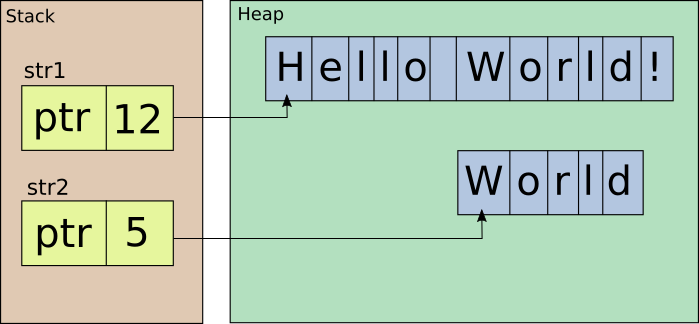

@title[Span&lt;T&gt; and Refs]

# Span&lt;T&gt; and Refs 

### *Safe memory optimizations in .NET*

**Antão Almada**<br>
*Principal Engineer @ Farfetch*<br>

@fa[creative-commons] @fa[creative-commons-by] 

---

## Safe memory optimizations in .NET

- Passing by reference
  + in
  + readonly struct
  + ref returns
  + ref locals
- Contiguous memory handling
  + Span&lt;T&gt;
  + Memory&lt;T&gt;

NOTE:

This presentation focus new features made available with C# 7 and .NET Core 2.1.

All these can significantly improve performance both CPU and memory.

"Safe" because some of these optimizations where possible but using pointers and the keyword 'unsafe'.

---

# Passing by reference

+++

## .NET Types 

- Value Types
- Reference Types
- Pointer Types

+++

## Value Types

- Byte, SByte, Int16, UInt16, Int32, UInt32, Int64, UInt64 
- Single, Double, Decimal
- Boolean, Char
- User-defined structs

+++

## Value Types

- Allocated on the stack 
  + Except when boxed
- Arguments passed by value
  + Full content is copied every time

Note:

- Allocated on the stack **is an advantage**.
- Arguments passed by value **may be a disadvange**.

+++

## Value over Reference Types

- Smaller memory footprint.
- Less GC overhead.
- Better performance on interface method calls.

+++

## DMS angle value type

```csharp
public struct Angle
{
    public int Degrees;
    public int Minutes;
    public double Seconds;
    
    public static void ByValue(Angle angle) {}
    public static void ByReference(ref Angle angle) {}
}
```

@[3-5]
@[7-8]

NOTE:

Size of structure is 128 bits => 16 bytes.

+++

## calls

```csharp
public class Example 
{
    Angle angle = new Angle { Degrees = 90, Minutes = 0, Seconds = 0.0 };
    
    void CallByValue() => 
        Angle.ByValue(angle);
    
    void CallByReference() => 
        Angle.ByReference(ref angle);
}
```

@[5-6, 8-9]

NOTE:
[SharpLab.io](https://sharplab.io/#v2:C4LglgNgPgsAUAAQMwAIDOwBOBXAxsFAQQDsBzCAU3gG94V6VkUxiCARC0zCitAbjoMmLAgFkW2YLwFwGjVABMA9tgBGlFAGUKuJcQX9B9I/MYBGAGyMALCgBCATwBqAQwjYKAChLkKKF2SUAJQo1AC+JkwIljb2DgBKFABmFNzEuF7cSUSBfgG+IeHwEXDwUQBMKACiAB4uALYADho0Jj4a+RoAvCjEFADuOb6hKBxcPGgoPQCcAAwANCjixJK8UygLWjp6BuuzAHSzKGEycpG2AMJuEI6u7l4hXQB8KCZy7RT7t24enp0UQVODHOKCuEBuCWSqQo6QeUxebwYHy+kJSaQyniy/lygOK8CAA===)

+++

## Intermediate Language

```
.method private hidebysig 
instance void CallByValue () cil managed 
{
    IL_0000: ldarg.0
    IL_0001: ldfld valuetype Angle Example::angle
    IL_0006: call void Angle::ByValue(valuetype Angle)
    IL_000b: ret
}

.method private hidebysig 
instance void CallByReference () cil managed 
{
    IL_0000: ldarg.0
    IL_0001: ldflda valuetype Angle Example::angle
    IL_0006: call void Angle::ByReference(valuetype Angle&)
    IL_000b: ret
}
```

@[1-2,10-11]
@[4-7, 13-16] (ldfld - Pushes the **value of field** onto the stack.<br/>ldflda - Pushes the **address of field** onto the stack.)

+++

## JIT Assembly

```
Example.CallByValue()
    L0000: push ebp
    L0001: mov ebp, esp
    L0003: add ecx, 0x4
    L0006: sub esp, 0x10
    L0009: movq xmm0, [ecx]
    L000d: movq [esp], xmm0
    L0012: movq xmm0, [ecx+0x8]
    L0017: movq [esp+0x8], xmm0
    L001d: call Angle.ByValue(Angle)
    L0022: pop ebp
    L0023: ret

Example.CallByReference()
    L0000: add ecx, 0x4
    L0003: call Angle.ByReference(Angle ByRef)
    L0008: ret
```

@[1-12]
@[14-17]

+++

## benchmarks

```
          Method |      Mean |     Error |    StdDev | Scaled | ScaledSD |
---------------- |----------:|----------:|----------:|-------:|---------:|
     CallByValue | 0.0489 ns | 0.0115 ns | 0.0102 ns |   1.00 |     0.00 |
 CallByReference | 0.0164 ns | 0.0062 ns | 0.0049 ns |   0.36 |     0.15 |
```

+++

```
public struct Angle
{
    public int Degrees;
    public int Minutes;
    public double Seconds;
    
    public static double ToDegrees(ref Angle angle) =>
        angle.Degrees + angle.Minutes / 60.0 + angle.Seconds / 3600.0;
}
```

@[7-8] (Pass argument by reference)
@[8] (No mutation are performed)

NOTE:

Using pass-by-reference improves performance but usually means the value will be changed, which it's not doing!

[SharpLab.io](https://sharplab.io/#v2:C4LgTgrgdgPgAgBgARwIwG4CwAoHcDMSAzsJAMbBICCUA5gDYCmOA3jkhyoQJZSUAijWmEaMiWbJy5JelALK8IwMRKkEkAEwD2EAEZMkAZUZktUDePacrHdWgBsmnfsZIAKlsHDRRABQiAM2o6AwBDEMYASiQAXgA+GykkcIZGADovETEkAGpkiLSFKCVsgHokewQ05DyUpjTjU3MiJHL8SqqECQBfHDxCOAAmJABRAA9QgFsABwNWRLtURzgAFhRUAA5faMS2bABIKQA3ULB81NikKEYAd2CLliRMn0uATgQAGiQikpaYpHwnyMJjMFkunSQ3VUSVsqFevhoqTSHmeYn8jCCdSikWhHF62HxQA=)

---

# in

+++

## Callee

```
public struct Angle
{
    public int Degrees;
    public int Minutes;
    public double Seconds;
    
    public static double ToDegrees(in Angle angle) =>
        angle.Degrees + angle.Minutes / 60.0 + angle.Seconds / 3600.0;
}
```

@[7-8] ('in' = 'ref readonly')

NOTE:

'in' is new keyword that means 'ref readonly' => no muttations allowed

**Better performance?**

+++

## Caller

```
var angle = new Angle { Degrees = 90, Minutes = 30, Seconds = 0.0 };
Console.WriteLine(Angle.ToDegrees(in angle));
```

@[2] (The use of 'in' is optional)

+++

## Caller generated code

```
Angle angle = default(Angle);
angle.Degrees = 90;
angle.Minutes = 30;
angle.Seconds = 0.0;
Angle angle2 = angle;
Console.WriteLine(Angle.ToDegrees(ref angle2));
```

@[5] (A defensive copy is performed)

NOTE:

**Defensive copies are performed every time an instance is declared as readonly but a method is called that may mutate it!**

[SharpLab.io](https://sharplab.io/#v2:D4AQDABCCMDcCwAoJIDMEDOAXATgVwGMsIBBAOwHMAbAUyQG8kJmp0BLM4gERopxpoYEiFqwgdiAWQ54sg4aLQQAJgHs8AI1oQAyjQKqyyoUxanmSmADYV6rTQgAVVTz4CMACg6lK2gIa+NACUEAC8AHzmohAB1DQAdK78ghAA1DGB8dJksikA9BBWYPGQ6bG08XoGRhgQBahFxWDCAL5IKOggAEwQAKIAHn4AtgAO2gxRltA2IAAsUNAAHB4hUYyIAJCiAG5+OBlxYRBkNADuPof0EEnuRwCcYAA0ENm5taEQqE+6+obGR00IC0FNELNA7h5yHF4s4boIPOVgkEQcw2og0UA===)

---

# readonly struct

+++

```
public readonly struct Angle
{
    public readonly int Degrees;
    public readonly int Minutes;
    public readonly double Seconds;
    
    public Angle(int degrees, int minutes, double seconds) =>
        (Degrees, Minutes, Seconds) = (
        	degrees, 
        	minutes < 60 ? 
        		minutes : 
        		throw new ArgumentOutOfRangeException(nameof(minutes)), 
        	seconds < 60.0 ? 
        		seconds : 
        		throw new ArgumentOutOfRangeException(nameof(seconds))
    	);
        
    public static double ToDegrees(in Angle angle) =>
        angle.Degrees + angle.Minutes / 60.0 + angle.Seconds / 3600.0;
}
```

@[1] ('readonly struct')
@[3-5] (Immutable => readonly fields)
@[7-16] (Constructor required to initialize)
@[18-19] (No changes!)

NOTE:

´readonly struct' guarantees that the struct is immutable. The value can only be set by the constructor.

[SharpLab.io](https://sharplab.io/#v2:D4AQDABCCMDcCwAoJIDMEBOBTAhgEwHsA7AGwE8IBnAFwwFcBjaiAQSIHMSskBvJCAVHTZ8xchACWRZgBEs7bFkoJEgoZlyFSFKcwCyUutSUq1aDaO0RCdAEZcIAZSwNieZf0GeB5tpywAFLrW8oqUADSS0hAAtobGEdYEdg6ULm6UAJQQALwAfN5qEAFyClhKkQZERhVO6UTu2TnFhWoAkHih5Ymtgm1x1QkQADwQAGyQAPyx8UoQAFwQ1AAWGAQA7hBEWJssGOx0MVjSAPJGJwBmAEo4HFgAogAeDFgADtQSxAFEOEcEFwEBjUsplIr0BG00q4GpQRuMwAA6KZUeruBZLVYbLY7Vj7Q7HahnQnXW7sB7PN4fL4/P4AqEZTKZQptTKmIoCQrmGBjJIpLAQAAqBFKYSCRFYHAcpK4TQKqnZEGlWARIu6EAA1IrJcqqsCIAB6eFIjVa/wI5zQtGG1ATRFgFQAXyQKHQIAATBAnr9Xg5eJzXdAeSAACxQaAADgC2UKfEQbTUADccBhTQ5mttdtqAp0ykpFgBOMCRIEJRaoIsoy2URZ21ngsP5gJ+LgIoWqpQBJWMtkCJ2IPtAA)

+++

## Caller generated code

```
Angle angle = new Angle(90, 30, 0.0);
Console.WriteLine(Angle.ToDegrees(ref angle));
```

@[1-2] (No defensive copies)

---

# ref returns

+++

## ref returns
@ul[spaced-list-items]

- Available on the CLR since first version!
- **Now available to you on C#!**

@ulend

+++

```
struct Mutable
{
    int value;

    public Mutable(int value) => 
        this.value = value;

    public int Value =>
        value;

    public void Increment() => 
        value++; 
}

var list = new List<Mutable> { new Mutable(1) };
list[0].Increment();
Console.WriteLine(list[0].Value); // value did not change!

var item = list[0];
item.Increment();
list[0] = item;
Console.WriteLine(list[0].Value); // value changed!       

var array = new Mutable[] { new Mutable(1) };
array[0].Increment();   
Console.WriteLine(array[0].Value); // value changed!
```

@[1-13] (*Mutable* contains a private integer field)
@[11-12] (*Increment()* mutates the value)
@[15-17] (The value in the list is **not mutate** as index operator returns a copy)
@[19-22] (Mutation has to be applied on the copy and then copied back to the list)
@[24-26] (The value in the array is **mutated** as index operator returns a reference)

NOTE:
[SharpLab.io](https://sharplab.io/#v2:C4LgTgrgdgPgAgBgARwIwG4CwAoRLUAsW2OAzsJAMbBICyEwAhgEYA2ApjgN45J9IBLKDQBujVhHbFe/OAGY6DFhwAUQ0eMkBKJAF4AfEhn9+wABYDSAOjET2epLcnTsJ+YOFIAapvsHjJo6+Lm4KcARIAJJQlGDsALbswio6BkaugXxO7ADUOejpAL44OO5oAGwoAEz4AOzpPBl8ZaiV4fgAHCnpJo2ZWYxgSKyWNLpIUOwA7kgAMqMAPPRMbOyGXBPTiiuqqDqFxP3DowDaCAC6VtGxCUnAKYf9aACcKiPkZ5c+dloFAPR/IJ2JAAEwEIImAHsaJQzIwoABzdgAQhKTUCYiGAmACQc72An0emWxCSuMTiiWSvwCJnxnwcJPiRMCLzepwuVm+2n+gOySFh8KRIOR/TRR0xSEGYEYAE8HJMZstlOwTuckBsFdtlSo9kgDjT+FLZZ8yTdKfdfvwDc1UK8jTKTVz2JaAUDJPy4Yj2MLRejithCkA==)

+++

## ref returns

### Can only be used on variables that survive scope exit!

+++

## ref returns

- **Can't** be used on:
  + Local variables
  + 'this'
- **Can** be used on:
  + Heap-allocated variables
  + Passed-by-reference arguments

+++

## Max

```
public static ref readonly Angle Max(in Angle left, in Angle right) =>
    ref Angle.ToDegrees(left) > Angle.ToDegrees(right) ? 
        ref left : 
        ref right;

public static ref readonly Angle Max(in Angle left, in Angle right)
{
    if (Angle.ToDegrees(left) > Angle.ToDegrees(right))
        return ref left;

    return ref right;
}
```

@[1-4] (lambda-style syntax)
@[6-12] (classic syntax)

NOTE: 

[SharpLab.io](https://sharplab.io/#v2:D4AQDABCCMDcCwAoJIDMEBOBTAhgEwHsA7AGwE8IBnAFwwFcBjaiAQSIHMSskBvJCAVHTZ8xchACWRZgBEs7bFkoJEgoZlyFSFKcwCyUutSUq1aDaO0RCdAEZcIAZSwNieZf0GeB5tpywAFLrW8oqUADSS0hAAtobGEdYEdg6ULm6UAJQQALwAfN5qEAFyClhKkQZERhVO6UTu2TnFhWoAkHih5Ymtgm1x1QkQADwQAGyQAPyx8UoQAFwQ1AAWGAQA7hBEWJssGOx0MVjSAPJGJwBmAEo4HFgAogAeDFgADtQSxAFEOEcEFwEBjUsplIr0BG00q4GpQRuMwAA6KZUeruBZLVYbLY7Vj7Q7HahnQnXW7sB7PN4fL4/P4AqEZTKZQptTKmIoCQrmGBjJIpLAQAAqBFKYSCRFYHAcpK4TQKqnZEGlWARIu6EAA1IrJcqqsCIAB6eFIjVa/wI5zQtGG1ATRFgNkc+U+dDcjQXCxacR+Bx6HCPMUS/wQLgXaiRKSBhwYCTsZbUWXgorYd3e5VC1VKAIh+MQPKRtPCrqZ6OxnPTZPBrCh9EVktxlSc9AEABuWAw0c6UGgkCFjloUnYAQTTqKABIAEQ8DOUAC+AAaIDxdQkZwByRcWjIzgA64/HKhnSBQLoATBAnr9Xg5eI2uzyQAAWLsADiHEEKfEQbTUzZwGFNXDQLk2K7NqASdGUSiLAAnGAkRAgkiyoHBKKWpQix2qySDfoIv7/kqZ7NNsoH+OBRboRAsHwbMFHIZE9Iwos0BIlhI5mNA0EBKmCK+v6SrQJEBGMg6ECHogYlAA=)

---

# ref locals

NOTE:

Allow storing references as local variables

+++

## MaxBy

```
public static ref Angle MaxBy(this Angle[] angles)
{
	if (angles.Length == 0)
		throw new ArgumentException(nameof(angles));

	ref var max = ref angles[0];
	for (var index = 1; index < angles.Length; index++)
	{
		ref var current = ref angles[index];
		if (Angle.ToDegrees(current) > Angle.ToDegrees(max))
				max = ref current;
	}

	return ref max;
}
```

@[1] (Returns a reference to the array item with the maximum value)
@[6] (Keeps a reference to the first item of the array)
@[7-12] (Iterates on the rest of the array)
@[9] (Keeps a reference to the current item of the array)
@[10-11] (Keep a reference to the largest value of the two references)
@[14] (Return a reference to the item with the largest value)

+++

## MaxBy

```
var angles = new[] {
	new Angle(degrees: 90, minutes: 30, seconds: 0.0),
	new Angle(degrees: 90, minutes: 30, seconds: 1.0),
	new Angle(degrees: 90, minutes: 30, seconds: 0.0),
};

angles.MaxBy() = new Angle(degrees: 1, minutes: 2, seconds: 3.0);

foreach (var angle in angles)
    Console.WriteLine(angle);
```

@[7] (Assigns a new value to the array item that had the largest value)

NOTE:

Extension method not possible on *IEnumerable* or *IList* as they don't return references (yet?)

---

# Span &lt;T&gt; and Memory&lt;T&gt;

+++

## Span &lt;T&gt; and Memory&lt;T&gt;

- Represents contiguous regions of arbitrary memory.
- Performance characteristics on par with arrays.
- APIs similar to the arrays.
- Can point to either managed or native memory, or to memory allocated on the stack.

+++

## String.Substring()

```
var str1 = "Hello World!";
        
var str2 = str1.Substring(6, 5);
        
Console.WriteLine(str2);
```

@[3] (Returns a new string)

NOTE: 

Imagine we want to output a segment of string...

[SharpLab.io](https://sharplab.io/#v2:C4LgTgrgdgPgAgBgARwIwG4CwAoHcDMKqAbCgExEDsSOA3jkoyoWqXACxEAcAFAJQ1sTJPSHCmANwCGYJAGdgYVEgC8SAEQAJAKYAbXQHskAdQNhdAEwCE6rGPGCHjabIVgKat6gB0AZQgARmgIPMQANEgArHx2To5OaACcPG5kMQxMAL44mUA==)

+++

### Substring



---

#Thank you!

@fa[twitter] [@AntaoAlmada](https://twitter.com/AntaoAlmada) <br/>

@fa[medium] [@antao.almada](https://medium.com/@antao.almada) <br/>

@fa[github] [aalmada](https://github.com/aalmada) <br/>

---

### References
- [NetFabric.Angle](https://github.com/NetFabric/NetFabric.Angle)
- [Smallest .Net ref type is 12 bytes (or why you should consider using value types)](https://theburningmonk.com/2015/07/smallest-net-ref-type-is-12-bytes-or-why-you-should-consider-using-value-types/) by Yan Cui
- [Value Types vs Reference Types](http://adamsitnik.com/Value-Types-vs-Reference-Types/) by Adam Sitnik
- [Readonly references](https://github.com/dotnet/csharplang/blob/master/proposals/csharp-7.2/readonly-ref.md) (proposal)
- [‘in’ will make your code slower](http://faithlife.codes/blog/2017/12/in-will-make-your-code-slower/) by Bradley Grainger
- [Performance traps of ref locals and ref returns in C#](https://blogs.msdn.microsoft.com/seteplia/2018/04/11/performance-traps-of-ref-locals-and-ref-returns-in-c/) by Sergey Teplyakov

+++

### References
- [Span&lt;T&gt;](https://github.com/dotnet/corefxlab/blob/master/docs/specs/span.md) (proposal)
- [Span](http://adamsitnik.com/Span/) by Adam Sitnik
- [How to use Span<T> and Memory<T>](https://medium.com/@antao.almada/how-to-use-span-t-and-memory-t-c0b126aae652) by Antão Almada
- [P/Invoking using Span<T>](https://medium.com/@antao.almada/p-invoking-using-span-t-a398b86f95d3) by Antão Almada
- [Slicing managed arrays using Span<T>](https://medium.com/@antao.almada/slicing-managed-arrays-ae4f412a5d9e) by Antão Almada
- [Introducing .NET Core 2.1 Flagship Types: Span T and Memory T](https://www.codemag.com/Article/1807051/Introducing-.NET-Core-2.1-Flagship-Types-Span-T-and-Memory-T) by  Ahson A. Khan

